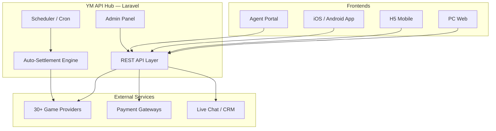

# YM321 Platform Architecture

> Overview for evaluation purposes. Detailed deployment docs available under commercial license.

## System Topology

## Domain Layout

Typical multi-domain deployment:

| Domain | Role |
|--------|------|
| `admin.example.com` | Admin panel |
| `www.example.com` | PC frontend |
| `m.example.com` | H5 mobile |
| `agent.example.com` | Affiliate / agent portal |

All frontends share a unified API backend.

## Tech Stack

| Layer | Technology |
|-------|------------|
| Backend | Laravel (PHP), MySQL, Redis |
| Frontend | Vue.js / static SPA, responsive H5 |
| Mobile | Capacitor (iOS & Android), remote hot updates |
| Web Server | Nginx, HTTPS / SSL |
| Chat | CRMChat (WhatsApp / Telegram integration) |

## Key Modules

### Game Aggregation

- 7 game categories: live casino, slots, lottery, sports, esports, fishing, chess
- 30+ providers pre-integrated (AG, PG, BBIN, EVO, SABA, etc.)
- Toggle providers on/off from admin panel

### Payment Hub

- Multi-channel deposits: USDT, bank cards, third-party aggregators
- Visual gateway configuration — no code changes required
- Withdrawal review workflow with flexible fee rules

### Agent System

- Multi-tier affiliate architecture
- Auto commission settlement
- Promotion link generation
- Independent domain deployment

### Operations

- VIP tier system with differentiated rebates
- Promotions, bonuses, in-app messaging
- Multi-language and multi-currency support
- Full audit logs and financial reporting

## Delivery Models

1. **Source License** — full codebase + docs + guidance
2. **Managed Setup** — server, domain, SSL, environment included
3. **Custom Development** — reskin, new providers, new payment channels

---

For architecture deep-dive and deployment guides, contact [@ym321com](https://t.me/ym321com).
